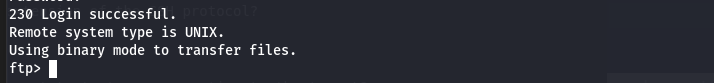
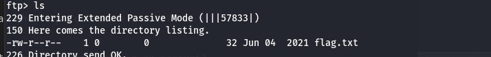
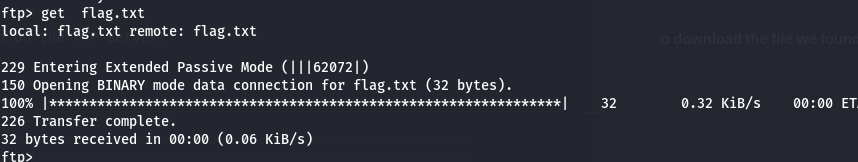

### Enumeration
1. by using nmap 
```bash
  nmap -sV -Pn -p21 10.129.239.122 
```
```
PORT   STATE SERVICE VERSION
21/tcp open  ftp     vsftpd 3.0.3
Service Info: OS: Unix

```

2. connect to ftp
```bash
  ftp 10.129.239.122 21
```


1. What does the 3-letter acronym FTP stand for? 
> file transfer protocol

2.  Which port does the FTP service listen on usually? 
> 21

3. FTP sends data in the clear, without any encryption. What acronym is used for a later protocol designed to provide similar functionality to FTP but securely, as an extension of the SSH protocol? 

> sftp

4. What is the command we can use to send an ICMP echo request to test our connection to the target? 
> ping

5. From your scans, what version is FTP running on the target? 
> vsftpd 3.0.3

6. From your scans, what OS type is running on the target? 
> unix

7.  What is the command we need to run in order to display the 'ftp' client help menu? 
> ftp -?

8. What is username that is used over FTP when you want to log in without having an account? 
> anonymous

9. What is the response code we get for the FTP message 'Login successful'?


10. There are a couple of commands we can use to list the files and directories available on the FTP server. One is dir. What is the other that is a common way to list files on a Linux system. 
> ls 

11. What is the command used to download the file we found on the FTP server? 
> get



13. download flag.txt
   ```bash
        get flag.txt
   ```


12.  Submit root flag 
