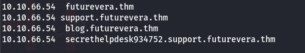

#  Challenge: Subdomain Enumeration

This challenge requires **subdomain enumeration** to obtain the flag.

---

##  Steps to Reproduce

### 1. Add Main Domain to `/etc/hosts`
Edit the `/etc/hosts` file and add the following entry:
```
10.10.66.54   futurevera.thm
```

  


---

### 2. Perform Subdomain Enumeration Using FFUF
Use the following command to brute-force subdomains:
```bash
ffuf -H "Host: FUZZ.futurevera.thm" -u https://10.10.66.54 -w /usr/share/wordlists/amass/subdomains-top1mil-110000.txt -fs 4605
```


---

### 3. Add Discovered Subdomains to `/etc/hosts`
Append the discovered subdomains to the `/etc/hosts` file:
```
10.10.66.54   support.futurevera.thm
# and others as discovered...
```


---

### 4. Explore Subdomains
Visit:  
**https://support.futurevera.thm/**  
Click the highlighted link:


Then, in the browser:
- Click **Connection not secure**
- Click **More Information** → **Security** → **View Certificate**

This often reveals more subdomains in the certificate details.


---

### 5. Add the New Subdomain
Add the revealed subdomain to `/etc/hosts`:
```
10.10.66.54   secrethelpdesk934752.support.futurevera.thm
```



---

### 6. Get the Flag
Visit:  
**https://secrethelpdesk934752.support.futurevera.thm**  
The flag will be displayed there.

